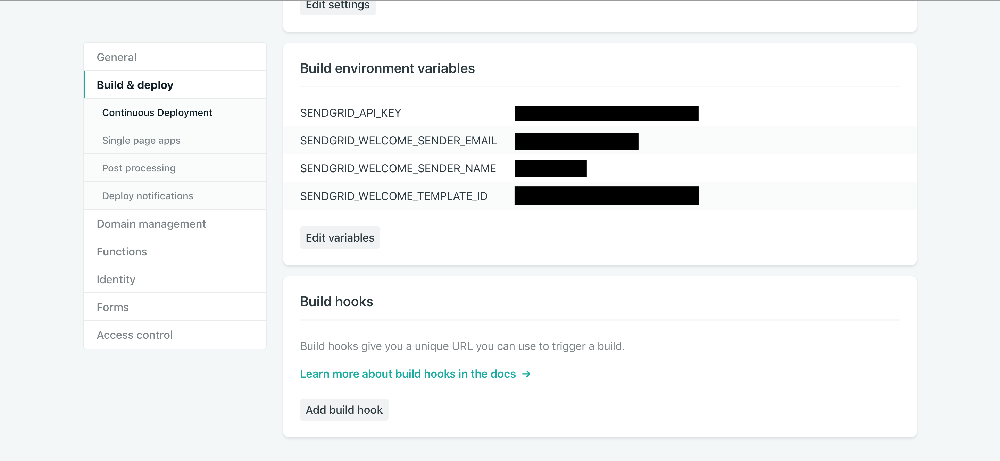
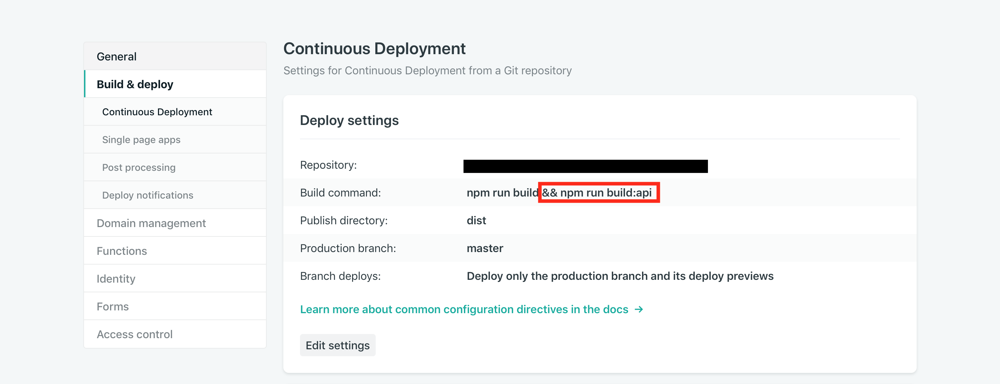

# Lambda Sendgrid Mailing List Rest API
A "ready to deploy" serverless mailing list subscription API endpoint using a Node.js [AWS Lambda]() function and the [Sendgrid](https://sendgrid.com) API. Collect emails and optionally, a welcome messages with a single `POST` HTTP request.

### Prerequisites
* Sendgrid Account + Sendgrid API Key
* Create a verified sender
* (Optional) Create a welcome email template with a

## Deploy as a Netlify Function
Navigate to your project's root:

`$ cd <path>/<to>/<site>`

Download the function sources into the subdirectory of your choice (eg: src/mailing-api):

`$ wget -P src/mailing-api https://raw.githubusercontent.com/ndethore/lambda-sendgrid-mailinglist-api/master/app.js`

Install the [netlify-lambda](https://github.com/netlify/netlify-lambda) CLI helper:

`npm install -g netlify-lambda` or `yarn global add netlify-lambda`

Add a build rule to your npm scripts in `package.json`:

```json
{	
	"scripts": {
		...
		"build:api": "netlify-lambda build src/mailing-api"
		
	}
}
```

Specify a build folder for your functions by adding a `function` field to your `netlify.toml` or on the web interface **Settings** > **Functions**. (Settings in `netlify.toml` override settings in the web interface):

```toml
[build]
  functions = "functions"
```

Add the following environment variables for the function:



Finally, add `&& npm run build:api` to the build command in your projects deployment setting.



### Usage
The endpoint is accessible from your webapp using the relative url `/.netlify/functions/mailing-api` and accepts `POST` HTTP requests with the following payload format:

```json
{
	"first_name": "Jhonny",
	"email": "jonny@appleseed.com"
}
```

Add the query parameter `?welcome_email=true` to email newly added recipients using the specified Sendgrid template ID.

### Local Testing

Create the following environment variables:

`SENDGRID_API_KEY`(Required) `SENDGRID_WELCOME_SENDER_EMAIL` `SENDGRID_WELCOME_SENDER_NAME` `SENDGRID_WELCOME_TEMPLATE_ID`

Add a proxy rule to your webpack configuration:

```json
{
...
 proxy: {
      "/.netlify": {
        target: "http://localhost:9000",
        pathRewrite: {"^/.netlify/functions" : ""}
      }
}
```

Run `netlify-lambda serve mailing-api`.  

## Todo
* Apex.run deployment instructions
* Serverless Framework deployment instructins

## License

MIT